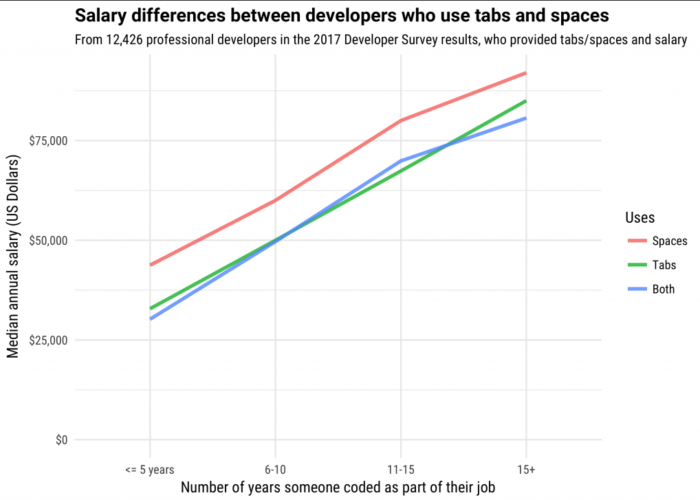

# Day 2 Work

Today's tasks were to get people familiar with python data types.

Fun fact: python programmers who use 4-spaces for indentation instead of TABs have largely higher salaries!

Source: https://fossbytes.com/programmers-spaces-versus-tabs-more-money/
